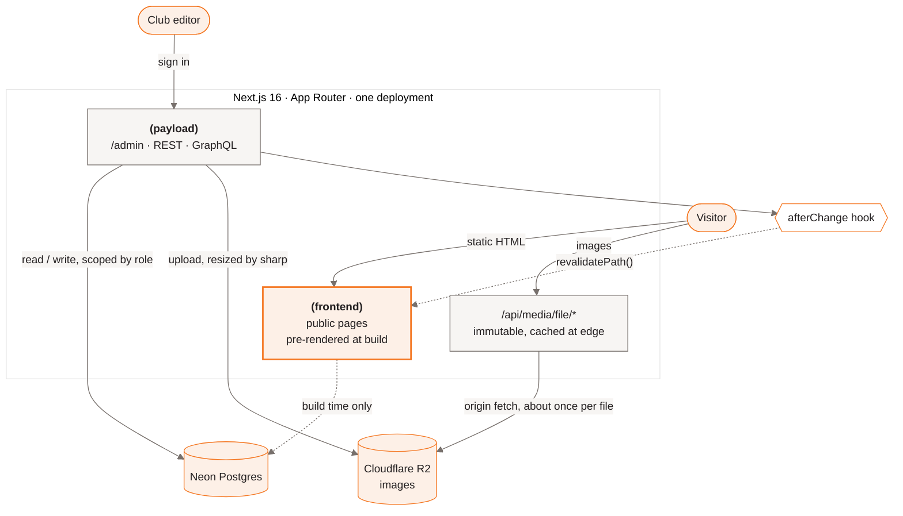
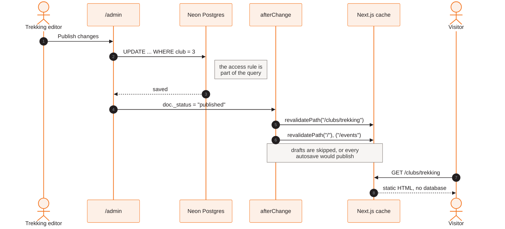
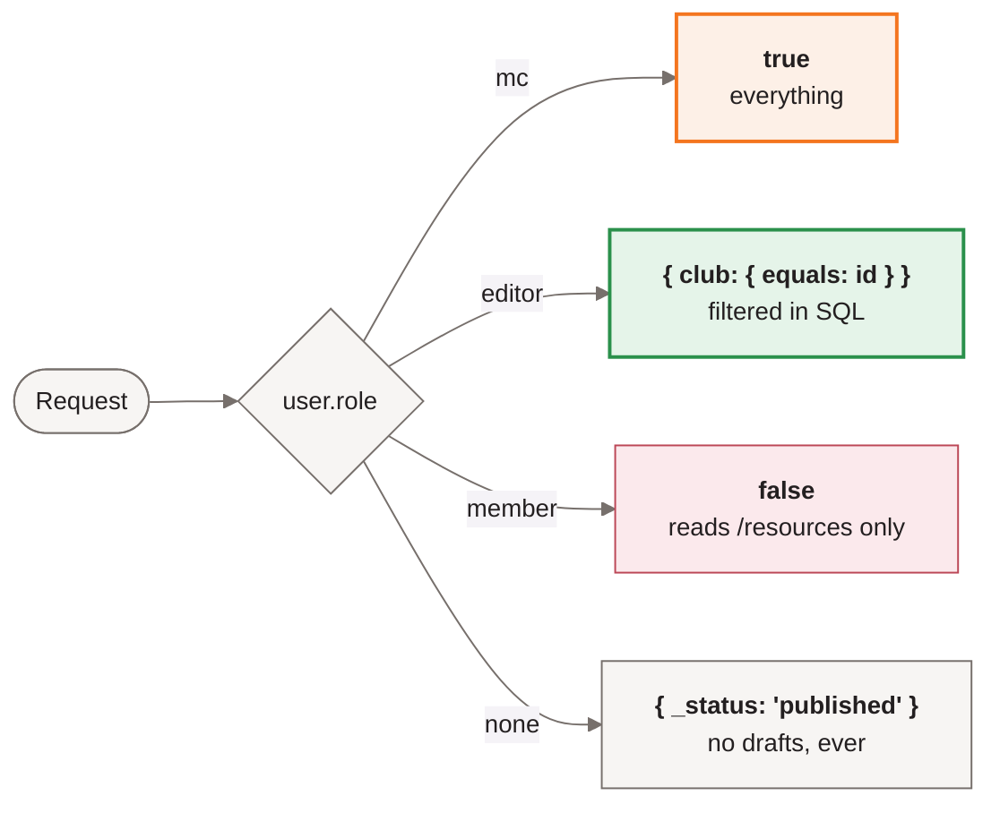
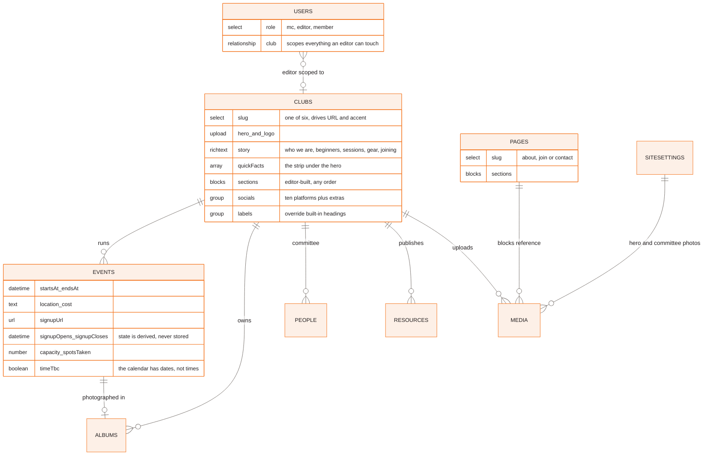
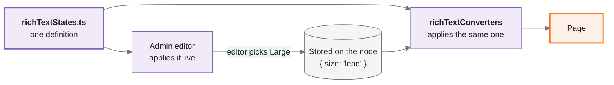

<h1 align="center">SMUX</h1>

<p align="center">
  <strong>SMUXploration Crew — the outdoor and adventure CCA at Singapore Management University</strong><br/>
  Six clubs &nbsp;·&nbsp; One site &nbsp;·&nbsp; Every club maintains its own page
</p>

<p align="center">
  
  
  
  
  
  
</p>

<p align="center">
  <a href="https://github.com/SMUXplorationCrew/smux-web/actions/workflows/ci.yml"></a>
</p>

<p align="center">
  
  
  
  
  
  
  
  
</p>

<br/>

<p align="center">
  A public site and a CMS in one deployment.<br/>
  Every page is pre-rendered; nothing queries the database while a visitor waits.<br/>
  Six club committees maintain their own pages without touching code.
</p>

<p align="center">
  
  
  
  
</p>

> [!NOTE]
> **The job this site has to do:** during recruitment week, a freshman on a phone finds
> a club and reaches a sign-up link in two taps. Every decision below serves that.

---

## Highlights

| | |
| :-- | :-- |
|  | **Six clubs, one theme engine.** A page sets `data-club="diving"` and every component downstream follows — no component hardcodes a club colour |
|  | **Club committees own their whole page.** Hero, facts strip, photos, contacts, closing call to action, section headings, and freeform sections — none of it needs a developer |
|  | **A style menu that cannot break a layout.** Headings, tables, size, typeface, colour and highlight — from a fixed palette with no pixel sizes and no layout properties |
|  | **Every public page pre-rendered.** Publishing revalidates exactly the paths a document affects; visitors never trigger a query |
|  | **Access control is a SQL query.** A Trekking editor's scope is a `WHERE` clause, not a hidden button — proven by an integration test, not asserted |
|  | **Resized once, on upload.** sharp writes 480/900/1800 WebP variants to R2; the site serves plain `` with `srcset` and never resizes per request |
|  | **State derived from dates, never stored.** "Opens 8 Sep" → "Sign up" → "Sign-ups closed", recomputed in the browser so a static page is never stale |
|  | **Checked at 390, 768 and 1280.** No horizontal overflow anywhere, 44px tap targets, and a wide table scrolls in its own box rather than the page |
|  | **Colour measured, not eyeballed.** Every accent clears 4.5:1 on every ground it can land on, including all six club tints |
|  | **Reveals that cannot blank a page.** Content is visible in the HTML and hides only once JavaScript confirms it can un-hide it; reduced motion switches it off entirely |
|  | **Open Graph cards drawn, not photographed.** Generated per route so a link pasted into Telegram always renders, plus `sitemap.xml`, `robots.txt` and per-event `.ics` export |
|  | **128 across three layers.** Pure functions, real scoped queries against Postgres, and Playwright over every route |

---

## Contents

- [Highlights](#highlights)
- [What the site does](#what-the-site-does)
- [Architecture](#architecture)
- [What each role can edit](#what-each-role-can-edit)
- [Rules the code follows](#rules-the-code-follows)
- [Repository layout](#repository-layout)
- [Local setup](#local-setup)
- [Cloud setup](#cloud-setup)
- [Testing](#testing)
- [Troubleshooting](#troubleshooting)
- [Content provenance](#content-provenance)

---

## What the site does

| Route | Purpose |
| --- | --- |
| `/` | Hero, the six clubs, upcoming events |
| `/clubs`, `/clubs/[slug]` | Club index, and per club: who they are, key events, sessions, joining, committee, achievements, FAQ, past trips |
| `/events`, `/events/[slug]` | All events, filterable by club; detail with sign-up |
| `/calendar` | Month grid of every session and trip |
| `/gallery` | Past-trip photos, grouped by album |
| `/committee` | Main committee and the SMUX-wide events they run |
| `/about`, `/join`, `/contact` | Editable in the CMS — no deploy needed to change copy |
| `/resources` | Members-only, behind a login |
| `/admin` | Payload CMS. Club editors see only their own club |

---

## Architecture

Payload runs **inside** the Next.js app. One codebase, one deployment, no separate
backend service.



Content flows one way: an editor publishes in `/admin`, a hook revalidates exactly the
paths that document affects, and the static pages regenerate. **Visitors never trigger a
database query.**

### Publishing, step by step

The dotted line above is the part worth spelling out, because it is what stops the CMS
from feeling broken — an edit that does not appear is indistinguishable from an edit
that did not save.



### Access control

Rules return a **database query**, not a boolean, so filtering happens in Postgres.



The `clubs` collection is the exception: a club document has no `club` field — it *is*
the club — so it compares on document id via `ownClubById`.

The role is checked **positively** at every branch. Falling through to the club query
for any non-`mc` user would hand a `member` exactly what an editor gets, which is the
bug [tests/int/access.int.spec.ts](tests/int/access.int.spec.ts) exists to catch.

### Content model



Optional relationships throughout: an event with no club is a SMUX-wide one the main
committee runs, and a person with no club is on the main committee.

### Design tokens

Every value the site uses is a token in `globals.css`. Nothing is an arbitrary utility —
if a value is missing it is added there, not written inline.

| | Token | Role |
| :-- | :-- | :-- |
|  | `--color-orange` `#f4751f` | The logo orange. Buttons and date badges — never small text, at 2.83:1 |
|  | `--color-accent-text` `#b84d0c` | The same hue darkened to clear 4.5:1. Every eyebrow, caption and label |
|  | `--color-ink` `#231f20` | Headings, sampled from the logo |
|  | `--color-copy` `#55504d` | Long-form copy |
|  | `--color-muted` `#77706c` | Secondary text. Do not go lighter |
|  | `--color-line` `#e1ddda` | Rules and borders |
|  | `--color-off` `#f7f5f3` | Alternating section grounds |

Each of the six club accents carries a matching tint ground and a darkened text
variant. A club page sets one attribute and all three follow:

```css
[data-club="diving"] {
  --color-accent:      #0086a4;   /* rules, borders, large type */
  --color-accent-tint: #e4f5fa;   /* section grounds */
  --color-accent-text: #006479;   /* anything under ~19px */
}
```

**Type** is Saira Condensed for display and Barlow for body, on a fixed scale from 12px
eyebrows to an 82px hero. Nothing below 11px; every tap target at least 44px.

### Stack

| Layer | Choice | Why |
| --- | --- | --- |
| Framework | Next.js 16, App Router, TypeScript strict | Pre-rendering is the reliability guarantee |
| CMS | Payload 3, same app | No second service to deploy or authenticate |
| Database | Neon Postgres, every environment | Dev/prod parity; branches are instant and free |
| Styling | Tailwind v4, `@theme` tokens | Club theming is runtime, via `data-club` |
| Media | Cloudflare R2 (`@payloadcms/storage-s3`) | Vercel's filesystem is ephemeral |
| Tooling | pnpm · Biome · Vitest · Playwright | |
| Hosting | Vercel | |

---

## What each role can edit

Nothing on the public site is hardcoded copy that only a developer can change. Every
heading, photo, link and block of text below is a CMS field, and where one is left empty
the site falls back to the wording it ships with — so a half-filled CMS produces a
finished-looking page, not a blank one.

| | **Club editor** | **Main committee** |
|---|---|---|
| Own club page | everything on it | everything on it |
| Own club's events, albums, people, resources | yes | yes |
| Other clubs | no — invisible in the admin panel | yes |
| Home page, menu, footer, committee page | no | yes |
| About / Join / Contact | no | yes |
| Accounts and roles | no | yes |

### What "everything on it" means for a club page

Under **Clubs → your club**, arranged in tabs:

- **Top of page** — hero photo, logo, the facts strip under the hero, who you are
- **For new members** — no-experience notes, what a session looks like, gear and cost,
  how to join
- **What we do** — signature events, achievements, FAQs
- **Photos** — the past-trips strip, chosen and ordered by hand
- **Contact** — ten platforms, plus a free list for anything not on it
- **Extra sections** — anything the fixed sections do not cover, built from blocks;
  also the closing call to action, and overrides for the built-in section headings

### Sections editors can add without code

Available on club pages, the editorial pages, the home page and the committee page:

`Text` · `Image + text` · `Card row` · `Photo grid` · `Link list` · `FAQ` ·
`Numbers strip` · `Quote` · `Call to action`

**Link list** is the one to reach for when a sign-up form, booking sheet or waiver needs
to go somewhere on the page. Every URL an editor types — here, in a card, a button or a
menu entry — passes through `safeUrl` in [src/lib/url.ts](src/lib/url.ts) before it
becomes an `href`, which accepts paths, `https:`, `mailto:` and `tel:` and rejects
everything else.

### Text formatting

The editor offers more than bold and italic, but only from a fixed menu — there is no
free-form style box, and nothing an editor can pick will break a layout.

| | |
|---|---|
| **Structure** | Headings h2–h4, lists, checklists, quotes, horizontal rules, alignment, indent |
| **Inline** | Bold, italic, underline, strikethrough, inline code, superscript, subscript, links |
| **Style menu** | Large · Small · Condensed · Monospace · Brand orange · Muted · Strong · Orange highlight · Grey highlight |
| **Blocks** | Tables, and images placed inline |

h1 is deliberately absent: the page title is the h1, and a second one breaks the
document outline invisibly in the editor and permanently on the site.

**The style menu is defined once**, in [src/lib/richTextStates.ts](src/lib/richTextStates.ts).
The admin panel applies those declarations live while editing and the site's converter
applies the same ones when rendering, so there is no second copy to drift — which is
the usual way "it looked right in the CMS" happens. Only the chosen key is stored on
the text node, so a value corrected in that file is corrected in every document already
written.

Two rules make it safe to hand over, and both are enforced by
[tests/unit/richTextStates.unit.spec.ts](tests/unit/richTextStates.unit.spec.ts):

- **No fixed pixel sizes.** Sizes are `clamp()` or `rem`, so editor-chosen type still
  scales between a phone and a desktop.
- **No layout properties.** Nothing in the menu may set `width`, `position`, `float`,
  `margin` or `display`, so a run of styled text cannot escape its column.

Colours are measured against every ground they can land on — paper, off-white, all six
club tints and both highlights — and clear 4.5:1 on the worst of them.

**Tables scroll inside their own box.** A five-column gear list cannot reflow to 390px,
so the choice is between a table that scrolls and a page that does; the container is
keyboard-focusable so it is still reachable without a mouse.

The admin panel loads the site's two typefaces and matches its type scale
([custom.scss](<src/app/(payload)/custom.scss>)), so what an editor sees while writing is
what the page renders.



Only the chosen key reaches the database, so the CSS behind it can be corrected later
for every document already written — and because both ends read the same file, there is
no second copy to drift.

### Social links

Editors are not expected to type URLs consistently. `t.me/smuxdiving`, `@smuxdiving`,
`smuxdiving` and the full `https://` form all resolve to the same link, in
[src/lib/socials.ts](src/lib/socials.ts) — one place, rather than each component
guessing. Ten platforms have their own icon; anything else goes in **extra socials**
with a label and shows a generic link glyph.

---

## Rules the code follows

1. **Every public page is pre-rendered.** No page queries the database at request time.
   Publishing calls `revalidatePath()` from a Payload `afterChange` hook. `/resources` is
   the single deliberate exception — a cached members-only page would be served to
   whoever asked next.
2. **Access control is a query, not a boolean.** Hiding UI is not access control.
3. **Alt text is required on every upload.** Enforced by the Media collection.
4. **Images resize on upload, never per request.** sharp writes 480/900/1800 WebP
   variants; the site serves them as plain ``, never through an optimiser.
5. **Sign-up state derives from dates**, never a stored status field, so nobody can
   forget to flip it — see `src/lib/signupState.ts`.

---

## Repository layout

<details>
<summary><strong>Project structure</strong></summary>

```
.github/workflows/   CI: typecheck, lint, unit tests, build
.agents/             Neon agent skills, installed by `neon skills`
src/
├── access/          access rules shared by every collection      ← backend
├── blocks/          the section palette editors build pages from  ← backend
├── collections/     Clubs, Events, Albums, People, Pages,        ← backend
│                    Resources, Media, Users
├── globals/         SiteSettings                                  ← backend
├── hooks/           revalidation on publish                       ← backend
├── seed/            real SMUX content and the photo library       ← backend
├── lib/             data access, date formatting, sign-up state   ← shared
├── components/      UI; only three are client components          ← frontend
└── app/
    ├── (frontend)/  the public site                               ← frontend
    └── (payload)/   admin panel and API (generated)               ← backend
tests/
├── unit/            pure functions, no database
├── int/             real queries against Postgres
└── e2e/             Playwright, including responsive checks
```

</details>

**On splitting `frontend/` and `backend/` at the root:** it would fight the framework.
Payload *is* the backend and it runs inside the same Next app, sharing its module
resolution, build and deployment. Next's route groups already draw the line —
`(frontend)` versus `(payload)` — and the directories above are grouped by role, marked
in the tree. Moving them would break `@payload-config` resolution and the generated
import map for no structural gain.

---

## Local setup

**Prerequisites:** Node 20 or newer, pnpm, and a Neon account (free).

###  &nbsp;Install

```bash
git clone https://github.com/SMUXplorationCrew/smux-web.git
cd smux-web
pnpm install
```

###  &nbsp;Get a database

Every developer works on their own Neon branch, so nobody overwrites anyone else.

```bash
npm i -g neon@latest
neon login
neon projects list --org-id <YOUR_ORG_ID>          # find the project id
neon branches create --name <your-name> --project-id <PROJECT_ID>
neon link --project-id <PROJECT_ID> --branch <your-name>
```

`neon link` writes `DATABASE_URL`, `DATABASE_URL_UNPOOLED` and `NEON_BRANCH` into `.env`
and keeps them current. **Both URLs are used, deliberately:**

| Environment | URL | Reason |
| --- | --- | --- |
| Local | `DATABASE_URL_UNPOOLED` (direct) | Payload pushes schema changes; Neon's pooler runs PgBouncer in transaction mode, which drops the session state DDL needs |
| Production | `DATABASE_URL` (pooled) | Serverless functions open many short-lived connections and would exhaust Postgres' limit |

###  &nbsp;Add the remaining secrets

```bash
cp .env.example .env.local.example   # reference only; neon link already wrote .env
openssl rand -hex 32                 # paste as PAYLOAD_SECRET in .env
```

| Variable | Required | Purpose |
| --- | --- | --- |
| `PAYLOAD_SECRET` | Yes | Signs login sessions. Changing it logs everyone out |
| `DATABASE_URL`, `DATABASE_URL_UNPOOLED` | Yes | Written by `neon link` |
| `R2_BUCKET`, `R2_ACCOUNT_ID`, `R2_ACCESS_KEY_ID`, `R2_SECRET_ACCESS_KEY`, `R2_ENDPOINT` | No | All five present switches uploads to R2; absent, they go to local disk |

###  &nbsp;Run

```bash
pnpm dev     # http://localhost:3000 — Payload creates the schema on first boot
pnpm seed    # six clubs, 133 events, 84 photos, three logins
```

`pnpm seed` reads photos from a directory outside the repo. Override its location with
`SEED_MEDIA_DIR=/path/to/photos pnpm seed`; missing files are skipped with a warning
rather than aborting the run.

Then open `http://localhost:3000/admin`.

| Login | Password | Scope |
| --- | --- | --- |
| `mc@smux.test` | `test1234` | Everything |
| `trekking@smux.test` | `test1234` | Trekking only — open a Diving event to see access control refuse |
| `member@smux.test` | `test1234` | Reads `/resources`, edits nothing |

> **`pnpm seed` is destructive.** It deletes every club, event, album, person, page and
> media record before rewriting them. Point it at your own branch, never at shared data.
> These are demo passwords in a public repository — change them before real use.

---

## Cloud setup

### Cloudflare R2

Required for any deployment: Vercel's filesystem is ephemeral, so uploads written to
local disk disappear between invocations.

1. Cloudflare dashboard → **R2** → enable it. The free tier is 10GB with no egress fees;
   a payment method is requested even though this project uses about 50MB.
2. Create a bucket, for example `smux-media`.
3. **Manage R2 API Tokens** → **Create API Token** → permission **Object Read & Write**,
   scoped to that bucket. Prefer this over Admin: if the token leaks, the blast radius is
   objects in one bucket rather than the whole account.
4. Copy the Access Key ID and Secret Access Key — shown once — and set the five `R2_*`
   variables in `.env` and in Vercel.

Images are served through `/api/media/file/*`, not R2's public `r2.dev` domain. `r2.dev`
is documented as development-only and rate limits hard — measured here at roughly fifteen
rapid requests before returning 403 — and a club page pulls forty images at once, so a
few simultaneous visitors would see images fail at random. Those responses are marked
`immutable`, so the CDN answers repeat views and the origin runs about once per file.
Attaching a custom domain to the bucket would lift the limit if a zone is ever added.

### Vercel

```bash
npm i -g vercel
vercel login
vercel link --project smux-web
```

Set these for both **Production** and **Preview**:

```
PAYLOAD_SECRET
DATABASE_URL
DATABASE_URL_UNPOOLED
R2_BUCKET  R2_ACCOUNT_ID  R2_ACCESS_KEY_ID  R2_SECRET_ACCESS_KEY  R2_ENDPOINT
```

```bash
vercel deploy --prod
```

Two things to know:

- **Schema push is disabled in production.** Concurrent serverless invocations would race
  each other applying DDL. Apply schema changes from a developer machine, then deploy.
- **New Vercel projects are SSO-gated by default.** Every route returns a 302 to a login
  until you disable it under Settings → Deployment Protection.

---

## Testing

```bash
pnpm build     # must pass
pnpm lint      # Biome
pnpm test      # integration + e2e
pnpm test:unit # pure functions, no database
```

| Suite | Count | Covers | Needs |
| --- | :--: | --- | --- |
| `test:unit` | **105** | Sign-up state at all three date boundaries · every access rule, including that a `member` never inherits an editor's club query · URL validation · social-handle normalisation · the rich-text converters, rendered to HTML the way a page does | Nothing |
| `test:int` | **12** | Real queries as real scoped users — proves Postgres honours the access filter, which a unit test cannot | A seeded database |
| `test:e2e` | **11** | Every route at 390 / 768 / 1280px for horizontal overflow · mobile nav · 44px tap targets · admin panel | A running server and a browser |

CI runs typecheck, lint, unit tests and the build on every push. Integration and e2e are
excluded because both need a live database; run them locally, or add a workflow that
provisions a throwaway Neon branch.

**Check anything visual at 390px, not just desktop.**

---

## Troubleshooting

| Symptom | Cause and fix |
| --- | --- |
| `Cannot connect to Postgres` on `pnpm dev` | `.env` missing or `DATABASE_URL_UNPOOLED` unset. Re-run `neon link` |
| Schema changes not applied | You are on the pooled URL. Local dev must use `DATABASE_URL_UNPOOLED` |
| Playwright: `Executable doesn't exist` | It pins one exact build. Point at an installed browser: `PLAYWRIGHT_CHROMIUM_PATH="/path/to/Chrome for Testing" pnpm test:e2e` |
| Seed fails on a `.HEIC` file | No browser renders HEIC, and sharp here reads its metadata but cannot decode pixels, so it produces no variants. Convert first: `sips -s format jpeg in.HEIC --out out.jpg` |
| Images 403 intermittently | You are pointing at `r2.dev`. Serve through `/api/media/file/*` instead — see [Cloudflare R2](#cloudflare-r2) |
| Deployed site returns 302 everywhere | Vercel Deployment Protection. Disable under Settings → Deployment Protection |

---

## Content provenance

- Club copy, FAQs, sessions, socials and achievements come from the Vivace 2026 CCA
  listings.
- Events come from the committee's own `SMUX Calendar (2026).xlsx`, where each event's
  club is decoded from the **cell fill colour** matched against the sheet's legend.
  Internal governance — council meetings, the AGM, exco retreats — is excluded.
- The calendar records dates but no times, so events carry `timeTbc` and render as
  "Fri 11 Sep" rather than an invented hour.
- Sign-up windows are the one derived field, by a single stated rule: open three weeks
  ahead, close two days before.
- Anything unconfirmed stays in `[SQUARE BRACKETS]` so it is greppable. **Never invent a
  price, venue or email.**

---

<div align="center">

**SMUXploration Crew** &nbsp;·&nbsp; Singapore Management University

<sub>Six clubs, one crew. Issues and pull requests welcome at
<a href="https://github.com/SMUXplorationCrew/smux-web">SMUXplorationCrew/smux-web</a>.</sub>

</div>
