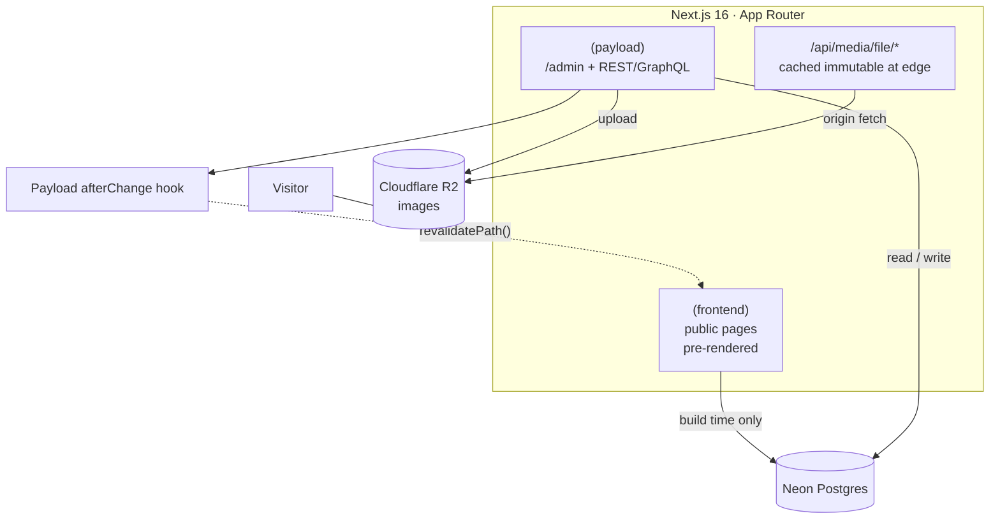
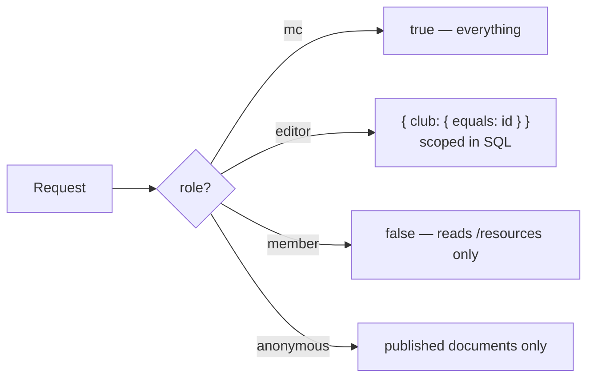

# SMUX — SMUXploration Crew

Public website and CMS for **SMUXploration Crew**, the outdoor and adventure CCA at
Singapore Management University. Six clubs — Biking, Diving, Kayaking, Skating, Trekking
and XSeed — under one site, with each club maintaining its own content.

> **The job this site has to do:** during recruitment week, a freshman on a phone finds a
> club and reaches a sign-up link in two taps. Every decision below serves that.

<!-- Badges are illustrative until CI has run on main. -->


---

## Contents

- [What the site does](#what-the-site-does)
- [Architecture](#architecture)
- [Rules the code follows](#rules-the-code-follows)
- [Repository layout](#repository-layout)
- [Local setup](#local-setup)
- [Cloud setup](#cloud-setup)
- [Testing](#testing)
- [Troubleshooting](#troubleshooting)
- [Content provenance](#content-provenance)

---

## What the site does

| Route | Purpose |
| --- | --- |
| `/` | Hero, the six clubs, upcoming events |
| `/clubs`, `/clubs/[slug]` | Club index, and per club: who they are, key events, sessions, joining, committee, achievements, FAQ, past trips |
| `/events`, `/events/[slug]` | All events, filterable by club; detail with sign-up |
| `/calendar` | Month grid of every session and trip |
| `/gallery` | Past-trip photos, grouped by album |
| `/committee` | Main committee and the SMUX-wide events they run |
| `/about`, `/join`, `/contact` | Editable in the CMS — no deploy needed to change copy |
| `/resources` | Members-only, behind a login |
| `/admin` | Payload CMS. Club editors see only their own club |

---

## Architecture

Payload runs **inside** the Next.js app. One codebase, one deployment, no separate
backend service.



Content flows one way: an editor publishes in `/admin`, a hook revalidates exactly the
paths that document affects, and the static pages regenerate. Visitors never trigger a
database query.

### Access control

Rules return a **database query**, not a boolean, so filtering happens in Postgres.



The `clubs` collection is the exception: a club document has no `club` field — it *is*
the club — so it compares on document id via `ownClubById`.

### Stack

| Layer | Choice | Why |
| --- | --- | --- |
| Framework | Next.js 16, App Router, TypeScript strict | Pre-rendering is the reliability guarantee |
| CMS | Payload 3, same app | No second service to deploy or authenticate |
| Database | Neon Postgres, every environment | Dev/prod parity; branches are instant and free |
| Styling | Tailwind v4, `@theme` tokens | Club theming is runtime, via `data-club` |
| Media | Cloudflare R2 (`@payloadcms/storage-s3`) | Vercel's filesystem is ephemeral |
| Tooling | pnpm · Biome · Vitest · Playwright | |
| Hosting | Vercel | |

---

## Rules the code follows

1. **Every public page is pre-rendered.** No page queries the database at request time.
   Publishing calls `revalidatePath()` from a Payload `afterChange` hook. `/resources` is
   the single deliberate exception — a cached members-only page would be served to
   whoever asked next.
2. **Access control is a query, not a boolean.** Hiding UI is not access control.
3. **Alt text is required on every upload.** Enforced by the Media collection.
4. **Images resize on upload, never per request.** sharp writes 480/900/1800 WebP
   variants; the site serves them as plain ``, never through an optimiser.
5. **Sign-up state derives from dates**, never a stored status field, so nobody can
   forget to flip it — see `src/lib/signupState.ts`.

---

## Repository layout

```
.github/workflows/   CI: typecheck, lint, unit tests, build
.agents/             Neon agent skills, installed by `neon skills`
src/
├── access/          access rules shared by every collection      ← backend
├── collections/     Clubs, Events, Albums, People, Pages,        ← backend
│                    Resources, Media, Users
├── globals/         SiteSettings                                  ← backend
├── hooks/           revalidation on publish                       ← backend
├── seed/            real SMUX content and the photo library       ← backend
├── lib/             data access, date formatting, sign-up state   ← shared
├── components/      UI; only three are client components          ← frontend
└── app/
    ├── (frontend)/  the public site                               ← frontend
    └── (payload)/   admin panel and API (generated)               ← backend
tests/
├── unit/            pure functions, no database
├── int/             real queries against Postgres
└── e2e/             Playwright, including responsive checks
```

**On splitting `frontend/` and `backend/` at the root:** it would fight the framework.
Payload *is* the backend and it runs inside the same Next app, sharing its module
resolution, build and deployment. Next's route groups already draw the line —
`(frontend)` versus `(payload)` — and the directories above are grouped by role, marked
in the tree. Moving them would break `@payload-config` resolution and the generated
import map for no structural gain.

---

## Local setup

**Prerequisites:** Node 20 or newer, pnpm, and a Neon account (free).

### 1. Install

```bash
git clone https://github.com/SMUXplorationCrew/smux-web.git
cd smux-web
pnpm install
```

### 2. Get a database

Every developer works on their own Neon branch, so nobody overwrites anyone else.

```bash
npm i -g neon@latest
neon login
neon projects list --org-id <YOUR_ORG_ID>          # find the project id
neon branches create --name <your-name> --project-id <PROJECT_ID>
neon link --project-id <PROJECT_ID> --branch <your-name>
```

`neon link` writes `DATABASE_URL`, `DATABASE_URL_UNPOOLED` and `NEON_BRANCH` into `.env`
and keeps them current. **Both URLs are used, deliberately:**

| Environment | URL | Reason |
| --- | --- | --- |
| Local | `DATABASE_URL_UNPOOLED` (direct) | Payload pushes schema changes; Neon's pooler runs PgBouncer in transaction mode, which drops the session state DDL needs |
| Production | `DATABASE_URL` (pooled) | Serverless functions open many short-lived connections and would exhaust Postgres' limit |

### 3. Add the remaining secrets

```bash
cp .env.example .env.local.example   # reference only; neon link already wrote .env
openssl rand -hex 32                 # paste as PAYLOAD_SECRET in .env
```

| Variable | Required | Purpose |
| --- | --- | --- |
| `PAYLOAD_SECRET` | Yes | Signs login sessions. Changing it logs everyone out |
| `DATABASE_URL`, `DATABASE_URL_UNPOOLED` | Yes | Written by `neon link` |
| `R2_BUCKET`, `R2_ACCOUNT_ID`, `R2_ACCESS_KEY_ID`, `R2_SECRET_ACCESS_KEY`, `R2_ENDPOINT` | No | All five present switches uploads to R2; absent, they go to local disk |

### 4. Run

```bash
pnpm dev     # http://localhost:3000 — Payload creates the schema on first boot
pnpm seed    # six clubs, 133 events, 84 photos, three logins
```

`pnpm seed` reads photos from a directory outside the repo. Override its location with
`SEED_MEDIA_DIR=/path/to/photos pnpm seed`; missing files are skipped with a warning
rather than aborting the run.

Then open `http://localhost:3000/admin`.

| Login | Password | Scope |
| --- | --- | --- |
| `mc@smux.test` | `test1234` | Everything |
| `trekking@smux.test` | `test1234` | Trekking only — open a Diving event to see access control refuse |
| `member@smux.test` | `test1234` | Reads `/resources`, edits nothing |

> **`pnpm seed` is destructive.** It deletes every club, event, album, person, page and
> media record before rewriting them. Point it at your own branch, never at shared data.
> These are demo passwords in a public repository — change them before real use.

---

## Cloud setup

### Cloudflare R2

Required for any deployment: Vercel's filesystem is ephemeral, so uploads written to
local disk disappear between invocations.

1. Cloudflare dashboard → **R2** → enable it. The free tier is 10GB with no egress fees;
   a payment method is requested even though this project uses about 50MB.
2. Create a bucket, for example `smux-media`.
3. **Manage R2 API Tokens** → **Create API Token** → permission **Object Read & Write**,
   scoped to that bucket. Prefer this over Admin: if the token leaks, the blast radius is
   objects in one bucket rather than the whole account.
4. Copy the Access Key ID and Secret Access Key — shown once — and set the five `R2_*`
   variables in `.env` and in Vercel.

Images are served through `/api/media/file/*`, not R2's public `r2.dev` domain. `r2.dev`
is documented as development-only and rate limits hard — measured here at roughly fifteen
rapid requests before returning 403 — and a club page pulls forty images at once, so a
few simultaneous visitors would see images fail at random. Those responses are marked
`immutable`, so the CDN answers repeat views and the origin runs about once per file.
Attaching a custom domain to the bucket would lift the limit if a zone is ever added.

### Vercel

```bash
npm i -g vercel
vercel login
vercel link --project smux-web
```

Set these for both **Production** and **Preview**:

```
PAYLOAD_SECRET
DATABASE_URL
DATABASE_URL_UNPOOLED
R2_BUCKET  R2_ACCOUNT_ID  R2_ACCESS_KEY_ID  R2_SECRET_ACCESS_KEY  R2_ENDPOINT
```

```bash
vercel deploy --prod
```

Two things to know:

- **Schema push is disabled in production.** Concurrent serverless invocations would race
  each other applying DDL. Apply schema changes from a developer machine, then deploy.
- **New Vercel projects are SSO-gated by default.** Every route returns a 302 to a login
  until you disable it under Settings → Deployment Protection.

---

## Testing

```bash
pnpm build     # must pass
pnpm lint      # Biome
pnpm test      # integration + e2e
pnpm test:unit # pure functions, no database
```

| Suite | Covers | Needs |
| --- | --- | --- |
| `test:unit` | Sign-up state at all three date boundaries; every access rule, including that a `member` never inherits an editor's club query | Nothing |
| `test:int` | Real queries as real scoped users — proves Postgres honours the access filter, which a unit test cannot | A seeded database |
| `test:e2e` | Every route at 390 / 768 / 1280px for horizontal overflow, mobile nav, 44px tap targets, admin panel | A running server and a browser |

CI runs typecheck, lint, unit tests and the build on every push. Integration and e2e are
excluded because both need a live database; run them locally, or add a workflow that
provisions a throwaway Neon branch.

**Check anything visual at 390px, not just desktop.**

---

## Troubleshooting

| Symptom | Cause and fix |
| --- | --- |
| `Cannot connect to Postgres` on `pnpm dev` | `.env` missing or `DATABASE_URL_UNPOOLED` unset. Re-run `neon link` |
| Schema changes not applied | You are on the pooled URL. Local dev must use `DATABASE_URL_UNPOOLED` |
| Playwright: `Executable doesn't exist` | It pins one exact build. Point at an installed browser: `PLAYWRIGHT_CHROMIUM_PATH="/path/to/Chrome for Testing" pnpm test:e2e` |
| Seed fails on a `.HEIC` file | No browser renders HEIC, and sharp here reads its metadata but cannot decode pixels, so it produces no variants. Convert first: `sips -s format jpeg in.HEIC --out out.jpg` |
| Images 403 intermittently | You are pointing at `r2.dev`. Serve through `/api/media/file/*` instead — see [Cloudflare R2](#cloudflare-r2) |
| Deployed site returns 302 everywhere | Vercel Deployment Protection. Disable under Settings → Deployment Protection |

---

## Content provenance

- Club copy, FAQs, sessions, socials and achievements come from the Vivace 2026 CCA
  listings.
- Events come from the committee's own `SMUX Calendar (2026).xlsx`, where each event's
  club is decoded from the **cell fill colour** matched against the sheet's legend.
  Internal governance — council meetings, the AGM, exco retreats — is excluded.
- The calendar records dates but no times, so events carry `timeTbc` and render as
  "Fri 11 Sep" rather than an invented hour.
- Sign-up windows are the one derived field, by a single stated rule: open three weeks
  ahead, close two days before.
- Anything unconfirmed stays in `[SQUARE BRACKETS]` so it is greppable. **Never invent a
  price, venue or email.**
